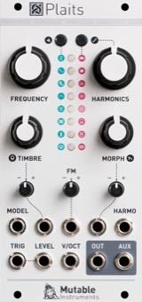

# ESTO ES SIMPLEPLAITS

## INSTALACIÖN
Bajar el [archivo binario](simple-plaits.bin) y flashear usando el[Daisy Seed web programmer](https://electro-smith.github.io/Programmer/)

Basado en Plaits de Mutable Instruments [Manual](https://pichenettes.github.io/mutable-instruments-documentation/modules/plaits/manual/)

## CONTROLES

**Switches**
- S07-S08 - Drone/Keyboard

**PADS**
- P10/P11 - UP/DOWN MODELOS
- P04-P09  - TECLADO

**Perillas**
- S31 - Frequency
- S32 - Harmonics
- S33 - Timbre
- S34 - Morph
- S37 - Scale
