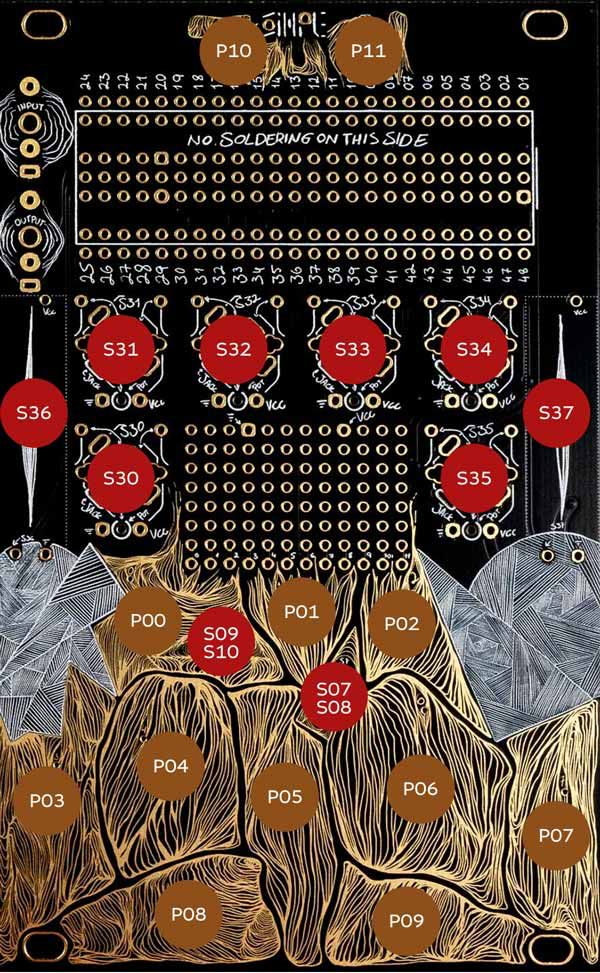

# ESTO ES SIMPLEPLAITS

## INSTALACIÖN
Bajar el [archivo binario](simple-plaits.bin) y flashear usando el[Daisy Seed web programmer](https://electro-smith.github.io/Programmer/)

Basado en Plaits de Mutable Instruments [Manual](https://pichenettes.github.io/mutable-instruments-documentation/modules/plaits/manual/)

## CONTROLES

**Switches**
- S07-S08 - Dron/teclado

**PADS**
- P01/P02 - UP/DOWN MODELOS
- P03-P10 - TECLADO

**Perillas**
- S11 - Frequency
- S34 - Harmonics
- S30 - Timbre
- S35 - Morph
- S37 - Escala

